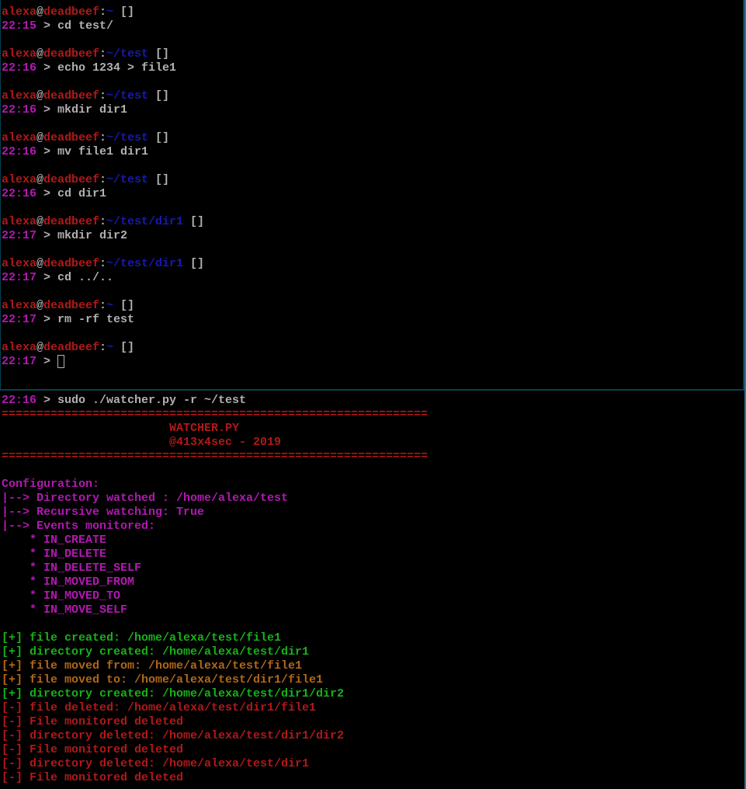

# watcher
Watcher is a small python script based on the inotify linux kernel API, which provides a way to monitor changes hapenning within a directory structure.

## Dependencies
- colorama (to display shiny colours)
- inotify (well ...)

## Installation
```bash
cd /opt
sudo git clone https://github.com/chatn0ir/watcher.git
cd watcher
sudo pip3 install requirements.txt
sudo ln -s /opt/watcher/watcher.py /usr/bin/watcher 
```

## Screenshots


## Usage
```
usage: watcher.py [-h] [-r]
                  [-v | -a | --events [{IN_ACCESS,IN_ATTRIB,...}, ...]]
                  directory

Monitor filesystem changes on Linux

positional arguments:
  directory             directory to monitor

optional arguments:
  -h, --help            show this help message and exit
  -r, --recursive       enable recursive watching
  -v, --verbose
  -a, --all
  --events [{IN_ACCESS,IN_ATTRIB,IN_CLOSE_NOWRITE,IN_CLOSE_WRITE,IN_CREATE,IN_DELETE,IN_DELETE_SELF,IN_MODIFY,IN_MOVED_FROM,IN_MOVED_TO,IN_MOVE_SELF,IN_OPEN} [{IN_ACCESS,IN_ATTRIB,IN_CLOSE_NOWRITE,IN_CLOSE_WRITE,IN_CREATE,IN_DELETE,IN_DELETE_SELF,IN_MODIFY,IN_MOVED_FROM,IN_MOVED_TO,IN_MOVE_SELF,IN_OPEN} ...]]
                        individual events to monitor
```

## Examples
### Monitor a single directory
```bash
./watcher.py dir
```

### Monitor a directory and its sub-folders
```bash
./watcher.py -r dir
```

### Select the level of verbosity
```bash 
./watcher.py dir                                 # default
./watcher.py -v dir                              # verbose
./watcher.py -a dir                              # display all events
./watcher.py --events IN_CREATE IN_DELETE dir    # display all events
```

## Events (excerpt from the inotify man page)
```
***IN_ACCESS (+)***
  File was accessed (e.g., read(2), execve(2)).

***IN_ATTRIB (*)***
  Metadata changed—for example, permissions (e.g., chmod(2)), timestamps (e.g., utimen‐
  sat(2)), extended attributes (setxattr(2)), link count (since Linux 2.6.25; e.g., for
  the target of link(2) and for unlink(2)), and user/group ID (e.g., chown(2)).

***IN_CLOSE_WRITE (+)***
  File opened for writing was closed.

***IN_CLOSE_NOWRITE (*)***
  File or directory not opened for writing was closed.

***IN_CREATE (+)***
  File/directory  created  in  watched  directory  (e.g.,  open(2)  O_CREAT,  mkdir(2),
  link(2), symlink(2), bind(2) on a UNIX domain socket).

***IN_DELETE (+)***
  File/directory deleted from watched directory.

***IN_DELETE_SELF***
  Watched file/directory was itself deleted.  (This event also occurs if an  object  is
  moved  to  another  filesystem,  since  mv(1)  in effect copies the file to the other
  filesystem and then deletes it from the original filesystem.)  In addition, an IN_IG‐
  NORED event will subsequently be generated for the watch descriptor.

***IN_MODIFY (+)***
  File was modified (e.g., write(2), truncate(2)).

***IN_MOVE_SELF***
  Watched file/directory was itself moved.

***IN_MOVED_FROM (+)***
  Generated for the directory containing the old filename when a file is renamed.

***IN_MOVED_TO (+)***
  Generated for the directory containing the new filename when a file is renamed.

***IN_OPEN (*)***
  File or directory was opened.
```

## Common errors
### inotify.calls.InotifyError: Call failed (should not be -1): (-1) ERRNO=(0)
This issue is know to affect Debin and Ubuntu versions. It occurs when the user subscribes too a largenumber of files. This frequently occurs when using recursive monitoring on a deep file structure.

This can be fixed by adding the following line to your `/etc/systcl.conf` file (see this [thread](https://github.com/dsoprea/PyInotify/issues/71))
```
fs.inotify.max_user_watches=524288
```
